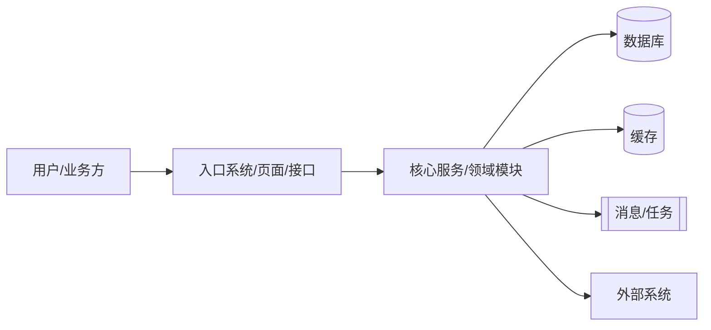
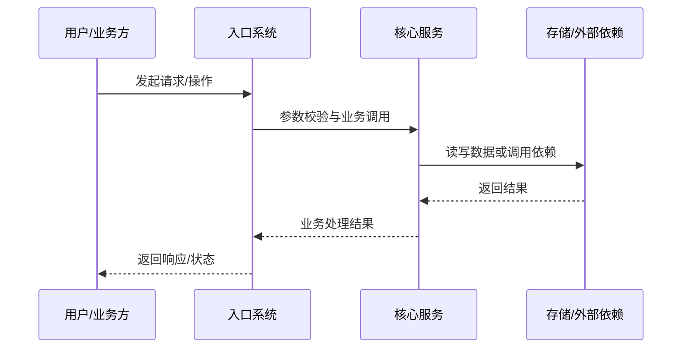

# by-tech-plan

使用本 skill 辅助研发同学产出可评审、可落地、可上线的技术方案文档。重点不是把模板填满，而是先识别需求复杂度，暴露隐藏假设、澄清关键取舍，并留下能让研发、测试、发布和运维团队共同执行的方案。

最终文档必须先按 **方案类型识别** 选择输出结构。风险判断必须完成，但只有命中的风险维度才需要在正文展开；未命中的维度可以省略，或用一句话说明“不涉及，原因是...”。L2/L3 使用完整模板，L0/L1 使用轻量模板。

## 启动前置动作

开始拷问或起草前，先明确用户本次真正要完成的事情。

- 先用一句话复述你理解的需求目标，例如：“我理解本次是要为{需求/项目}产出一份可评审的技术方案，重点解决{核心问题}。”
- 如果用户没有提供材料，主动要求补充可用输入：PRD/需求文档、飞书文档、接口文档、代码仓库地址、目标分支、相关模块、历史方案或线上问题链接。
- 如果用户已经提供部分材料，先确认这些材料分别承担什么角色：PRD、技术背景、现有实现、接口约束、测试依据或上线约束。
- 如果代码仓库地址或文档地址暂时没有，也不要阻塞。说明你会基于当前上下文先推进，并把缺失材料记录到 **问题记录**。
- 明确交付物形态：只要 Markdown 草稿、要更新飞书文档、要生成可复制到模板的正文，还是要继续陪用户逐轮完善。

## 方案前置校准

进入拷问或起草前，先做一次简短校准，避免静默选择错误方向。

- 复述你理解的需求目标：本次到底要解决什么问题。
- 明确本期成功标准：什么结果出现，才算本期方案可验收。
- 区分当前信息状态：哪些是已确认事实，哪些是推荐假设，哪些是待确认问题。
- 如果存在多种理解，列出不同理解及影响，不要替用户静默选择。
- 如果 P0 阻塞决策无法从材料中确认，先问；如果只是 P1/P2 信息，给出推荐假设并继续推进。

## 方案类型识别

起草前先给出推荐方案类型，并说明判断依据。默认从轻量类型开始，命中风险触发条件后再升级；不要一上来默认套完整模板。

| 类型 | 适用场景 | 输出重点 |
| --- | --- | --- |
| L0 交付执行单 | 需求明确、单点改动、无架构取舍、无库表/接口契约/跨系统影响 | 改动明细、执行步骤、验收方式 |
| L1 轻量技术方案 | 单系统或单模块，有少量流程、接口、配置或页面调整，但风险局部可控 | 方案细节、核心流程、涉及项设计、验证上线 |
| L2 标准技术方案 | 多模块或多系统协作，涉及库表、接口契约、兼容、灰度、数据迁移或运维观察 | 使用完整 9 章模板，展开关键设计和取舍 |
| L3 深度评审方案 | 核心交易/资金/履约链路，强一致性、高并发、安全权限、外部依赖或复杂回滚 | 在 L2 基础上强化 ADR、压测、监控、应急预案和人工恢复 |

命中下列任一条件时，不能使用 L0；命中多项或影响核心链路时优先升级到 L2/L3：

- 新增或修改数据库表、索引、状态机、缓存结构、消息体或定时任务。
- HTTP/RPC/MQ/Event 等外部契约变化，或需要兼容旧客户端、旧数据、旧配置。
- 跨系统、跨仓库、跨团队发布，或存在明确发布顺序依赖。
- 涉及异步、重试、补偿、幂等、并发一致性、分布式锁、限流降级。
- 涉及历史数据迁移、回填、清洗、权限、隐私、安全、审计、风控。
- 回滚成本高，或失败会影响核心业务链路、资金、订单、履约、计费、结算。

如果用户明确要求轻量输出，但材料命中升级条件，先指出升级原因，再给出“轻量正文 + 风险附录”或建议使用 L2/L3。

### L0/L1 方案细节优先

L0/L1 不是缩小版完整技术方案，而是面向交付的方案细节文档。正文优先回答“具体怎么改、按什么步骤做、怎么验收、怎么上线/回滚”，其他模块尽量省略。

- 背景、目标、非目标只保留必要信息，通常 1-3 句话即可。
- 不单独展开修改历史、人力安排、运维方案、方案优缺点、完整架构图、容量压测、ADR，除非风险扫描命中。
- 不为了模板完整性写“暂无”“不涉及”的长段落；确需说明时，用一句话放在相关细节下。
- L0/L1 的“方案细节”必须靠前，不能把主要篇幅放在背景、需求拆分或管理信息上。
- 如果方案细节写不清，优先补充改动表、步骤、输入输出、状态变化、配置项、接口字段或验收样例，而不是补充泛化章节。

## 工作模式

根据当前上下文选择模式。

### 1. 拷问模式

当用户只有粗略想法、PRD 链接、半成品方案，或明确说“帮我梳理/帮我完善/帮我拷问方案”时，使用拷问模式。

- 不要机械地“一次只问一个问题”。先把问题分为三类，再决定交互节奏：
  - **P0 阻塞决策**：不确认会影响方案方向、系统边界、数据归属、主方案取舍、库表设计、兼容策略或上线回滚。P0 问题逐个确认，单轮最多提出 1-3 个。
  - **P1 重要假设**：影响方案质量，但可以先按推荐答案推进。P1 问题批量确认，每批最多 5-8 个。
  - **P2 非阻塞信息**：负责人、精确排期、指标阈值、数据量精确值等暂不影响初稿方向的信息，直接采用推荐假设并写入 **问题记录**。
- 每个问题都先给出你的推荐答案、判断依据和如果判断错误会影响什么，再请用户确认或修正。
- 批量确认时允许用户回复“全部按推荐继续”。用户只修正部分问题时，未修正项默认采用推荐答案，并在 **问题记录** 标记为“待确认假设”。
- 当 P0 已明确，且 P1/P2 都已有推荐判断时，进入合成模式先做信息回放；用户确认、修正或要求继续后，再按推荐方案类型产出初稿，不要为了逐项确认所有问题阻塞文档起草。
- 如果答案能从代码库、现有文档、接口文档、数据库表结构、日志或 ADR 中找到，就先查证，不要直接问用户。
- 按依赖顺序推进决策树：业务目标 → 影响系统 → 数据模型与 SQL schema → 核心流程 → 重点难点与伪代码 → 接口 → 分布式/高并发/一致性/幂等 → 兼容 → 测试 → 上线 → 可观测性 → 风险。
- 当用户使用“账号”“订单”“状态”“回调”“补偿”“异步”“兼容”“灰度”等模糊或重载词时，按影响范围归类：影响核心链路的作为 P0，局部字段或表述的作为 P1/P2。
- 当用户描述的行为与代码或文档冲突时，作为 P0 立即指出冲突，并询问哪个来源更权威。
- 持续维护一个未解决问题清单，不要在对话推进中遗失。

### 2. 合成模式

当当前对话、PRD、代码库和文档已经提供足够信息时，使用合成模式，但不要直接起草方案。先把已经掌握的信息和推荐方案类型简要复述给用户，给用户一次校正机会，再进入对应模板起草。

- 起草前先做一次“信息回放”：需求目标、本期成功标准、本期非目标、推荐方案类型、已知材料、涉及系统/代码仓库、核心链路、关键约束、已确认事实、推荐假设和待确认问题。
- 信息回放要简洁，重点用于校准理解，不要提前展开成方案正文。
- 信息回放必须区分“已确认事实”“推荐假设”“待确认问题”。如果用户回复“全部按推荐继续”，直接按推荐方案类型起草文档。
- 不要为了非阻塞细节反复访谈。对未知信息做显式假设，并记录到 **问题记录**。
- 如果方案依赖代码现状，先探索代码库再起草。
- 如果存在 `CONTEXT.md` / `CONTEXT-MAP.md`，使用其中的项目领域词汇。
- 尊重相关 ADR。若 ADR 已经约束了边界、技术选型或集成方式，不要轻易提出相反方案。
- 将实现拆成职责稳定的模块。优先识别深模块：外部接口简单、内部承载较多行为、可以独立测试。
- 产出与方案类型匹配的成稿文档，不要只给松散大纲。

## 代码库与文档感知

在询问用户架构或现状行为之前，先查找本地证据：

- `CONTEXT-MAP.md`：用于识别多上下文仓库。
- 根目录或上下文目录下的 `CONTEXT.md`：用于确认规范领域语言。
- `docs/adr/`：用于确认已经存在的技术决策。
- 现有接口文档、schema、数据库迁移、配置、controller、service、client、测试和部署脚本。
- 类似链路或相邻业务的已有实现。

如果没有 `CONTEXT.md`，不要主动创建，除非当前正在和用户共同解决领域术语问题。若某个术语已经被明确，并且后续会继续影响方案，请按 `CONTEXT-FORMAT.md` 创建或更新 `CONTEXT.md`。

谨慎提出 ADR。只有同时满足下面三个条件时，才建议创建 ADR：

1. 决策难以逆转。
2. 如果没有上下文，未来读者会疑惑为什么这样做。
3. 这是一个真实取舍的结果，而不是显而易见的选择。

写 ADR 时使用 `ADR-FORMAT.md`。

## 方案设计原则

### 最小可落地方案优先

- 优先给出能满足当前需求的最小可落地方案。
- 不提前设计扩展能力，不为了未来可能性引入配置、抽象、状态机、任务系统或表结构。
- 如果存在更简单方案，先说明它是否可行；如果不采用，说明它为什么不能满足当前需求。
- 如果复杂方案更合理，必须解释复杂性来自哪里，例如一致性、兼容性、性能、审计、安全或跨系统发布约束。
- 不把“未来可能会用到”作为本期设计理由。后续演进可以写入非目标或问题记录。

### 改动范围约束

- 每个改动点必须能追溯到一个明确需求点、验收口径或风险控制目标。
- 不做顺手重构，不改无关模块，不调整无关格式、命名或注释。
- 发现无关问题时，只记录到 **问题记录**，不要并入本期方案。
- 涉及多个仓库时，按仓库列出必要改动；无法说明必要性的改动应从方案中移除。

## 质量门禁

质量门禁是风险扫描清单，不是正文展开清单。所有方案都要先扫描；L0/L1 只展开命中的风险维度，L2/L3 才按完整模板逐项展开。没有命中的维度不要硬写长段落，可以省略，或用一句话说明“不涉及，原因是...”。

- **业务适配**：解决什么问题、面向谁、哪些事情不在本期范围内？
- **前置校准**：是否说明了需求目标、本期成功标准、本期非目标、已确认事实、推荐假设、待确认问题和多种理解的取舍？
- **方案类型**：是否说明了推荐使用 L0/L1/L2/L3 的判断依据？是否检查了升级触发条件？
- **需求拆分**：有哪些子需求、边界、依赖和边缘场景？L0/L1 可合并到目标、改动明细或验收口径里，不单独成章。
- **方案最小化**：是否优先选择最小可落地方案？如果采用复杂方案，是否说明简单方案为什么不够？
- **改动范围**：每个改动点是否能追溯到需求点或风险控制目标？是否排除了顺手重构和无关改动？
- **系统影响**：是否说明上下游、应用边界和数据流？L2/L3 是否先用高维度系统关系图，再逐项列出应用/模块、接口、任务、消息、缓存、数据库、配置、权限、监控、发布和回滚影响？
- **代码仓库改动**：涉及多个工程或代码仓库时，是否列出每个仓库/工程的改动模块、主要改动、联动依赖、发布顺序和验证方式？
- **核心流程**：正常路径、失败路径、重试路径和补偿路径分别是什么？
- **数据设计**：新增或修改哪些表、模型、字段、状态、索引？涉及库表修改时，是否完整列出了 DDL、索引、初始化 SQL、迁移/回填 SQL、回滚 SQL 和兼容读写策略？未命中时 L0/L1 不展开。
- **接口契约**：HTTP、RPC、事件、消息或定时任务有哪些变化？是否包含请求、响应、错误码、幂等字段和兼容策略？未命中时 L0/L1 不展开。
- **一致性**：哪里需要事务、最终一致性、去重、加锁或顺序保证？
- **重点难点**：关键算法、状态流转、幂等判断、补偿流程或复杂分支是否用符合 Java 8 风格的伪代码表达清楚？
- **分布式与高并发**：是否已扫描多实例部署、并发请求、重复消息、分布式锁、缓存一致性、限流降级、热点数据和故障重试？命中风险时是否展开处理策略？
- **并发处理**：重复点击、重复回调、重试、并行任务、竞态更新时会发生什么？
- **数据量与性能**：预估数据规模是多少？哪些查询或调用可能成为热点？
- **兼容性**：哪些旧行为必须继续可用？哪些客户端、版本、配置或下游会受影响？
- **安全与权限**：是否涉及鉴权、数据权限、隐私、审计或风控约束？
- **测试方案**：哪些外部可观察行为需要单测、集成测试、回归测试、契约测试或人工验证？
- **上线方案**：发布顺序、配置开关、数据初始化、灰度、回滚和上线验证如何设计？
- **运维方案**：需要哪些指标、日志、告警、看板、巡检、预案和手工恢复步骤？
- **风险识别**：最可能失败的点是什么？团队如何发现并处理？

## 文档模板

按推荐方案类型选择模板。L0/L1 聚焦方案细节，只保留“目标、方案细节、验收上线、问题记录”；背景、人力、运维、架构图等模块默认省略。L2/L3 使用完整 9 章结构，一级标题保持不变。

### L0 交付执行单

用于需求非常明确、无明显技术取舍、无升级触发条件的交付任务。

```md
# 一、目标与验收

**需求目标：** {一句话说明本次要交付什么}

**验收口径：**
- {可被产品/测试/业务验证的结果}

# 二、方案细节

**改动明细：**

| 改动项 | 当前情况 | 目标结果 | 具体做法 | 验证方式 |
| --- | --- | --- | --- | --- |
| {页面/接口/配置/脚本/文档/代码模块} | {现状} | {交付后结果} | {具体怎么改} | {如何验证} |

**执行步骤：**

1. {步骤 1}
2. {步骤 2}
3. {步骤 3}

**关键约束：** {没有则省略；例如配置值、开关、输入输出、数据处理边界}

# 三、测试与上线

**测试范围：**
- {测试点}

**上线方式：**
- {发布/配置/脚本执行方式}

**回滚方式：**
- {如何回滚；如果不需要，说明原因}

# 四、问题记录

| 问题 | 当前判断/推荐答案 | 状态 | 负责人 |
| --- | --- | --- | --- |
| {问题} | {推荐答案或假设} | 待确认/已确认 | {负责人} |
```

### L1 轻量技术方案

用于单系统或单模块的局部变更。不要引入完整架构图、伪代码、SQL、压测等章节，除非风险扫描命中。

```md
# 一、目标与范围

**PRD/需求来源：** {链接或“暂无”}

**目标：** {1-3 句话说明本次要交付什么}

**范围边界：** {只写本期关键边界；没有则省略}

**推荐方案类型：** L1 轻量技术方案，原因：{判断依据}

# 二、方案细节

**改动明细：**

| 影响对象 | 当前行为 | 目标行为 | 具体做法 | 验收口径 |
| --- | --- | --- | --- | --- |
| {模块/接口/页面/配置/数据项} | {现状} | {目标} | {具体怎么改} | {可验证结果} |

**核心流程：**
{用步骤说明正常路径和必要异常路径；如有复杂分支再补 Mermaid。}

**涉及项设计：**
- 数据：{只写新增/修改/读取规则；不涉及则省略}
- 接口：{只写接口、字段、错误码、兼容点；不涉及则省略}
- 配置：{只写配置项、默认值、开关策略；不涉及则省略}
- 任务/消息：{只写触发、重试、幂等、补偿；不涉及则省略}

# 三、测试与上线

**测试重点：**
- {测试点}

**上线方式：**
- {发布顺序、配置、验收}

**回滚方式：**
- {回滚动作或“不涉及，原因是...”}

# 四、问题记录

| 问题 | 当前判断/推荐答案 | 状态 | 负责人 |
| --- | --- | --- | --- |
| {问题} | {推荐答案或假设} | 待确认/已确认 | {负责人} |
```

### L2 标准技术方案 / L3 深度评审方案

L2 使用下面完整结构。L3 在 L2 基础上必须强化 ADR/取舍背景、容量与压测、监控告警、应急预案、人工恢复和跨团队发布协同。

````md
# 一、修改历史

| 版本 | 变更日期 | 变更人 | 变更内容 |
| --- | --- | --- | --- |
| v0.1 | YYYY-MM-DD | {姓名/角色} | 初稿 |

# 二、项目背景

**PRD：** {PRD 链接或“暂无”}

**接口文档：** {接口文档链接或“暂无”}

**背景说明：**
{说明业务背景、现状问题、目标用户/业务方、为什么现在要做。}

**目标：**
- {目标 1}
- {目标 2}

**非目标：**
- {本期不做的事项}

# 三、需求细分

| 需求点 | 说明 | 优先级 | 依赖/约束 | 验收口径 |
| --- | --- | --- | --- | --- |
| {需求点} | {说明} | P0/P1/P2 | {依赖或约束} | {可验证结果} |

**边界与场景：**
- 正常场景：{...}
- 异常场景：{...}
- 兼容场景：{...}

# 四、方案设计

## 1. 方案一(主)

### 方案概述
{用几段话说明整体思路、涉及系统、关键链路、主要取舍。}

### 方案取舍与最小化说明
{说明为什么当前方案是最小可落地方案；如果没有采用更简单方案，说明原因；如果没有采用更复杂方案，说明不做的原因。}

### 系统影响范围
{先说明本次变更的系统边界、上下游依赖、是否影响存量链路。不要只写服务名。}

| 影响对象 | 类型 | 影响方式 | 具体变化 | 兼容/迁移策略 | 验证方式 | 负责人 | 风险等级 |
| --- | --- | --- | --- | --- | --- | --- | --- |
| {系统/模块/资源} | 应用/模块/接口/任务/消息/缓存/数据库/配置/权限/监控/发布 | 新增/修改/依赖/废弃/无影响 | {具体影响} | {兼容、灰度、回滚、迁移或“不涉及”} | {单测/联调/回归/观测项} | {负责人} | 高/中/低 |

### 代码仓库改动清单
{涉及多个工程或代码仓库时必须填写；单工程也写一行。若无代码改动，写“不涉及”。仓库名未知时写当前假设，并同步记录到 **九、问题记录**。}

| 代码仓库/工程 | 所属系统/应用 | 改动模块 | 改动类型 | 主要改动 | 依赖/联动仓库 | 发布顺序 | 验证方式 | 负责人 |
| --- | --- | --- | --- | --- | --- | --- | --- | --- |
| {repo/project} | {系统/应用} | {模块/包/目录或“不涉及”} | 新增/修改/删除/配置/脚本/无代码改动 | {具体改动点} | {依赖的 repo/project 或“不涉及”} | 第 1/2/3 步或“不限制” | {单测/集成/联调/回归/观测项} | {负责人} |

### 流程设计
{先给出高维度整体架构图，再给出核心业务流程。若目标文档平台不支持 Mermaid，说明需要转成图片贴入。}

#### 1. 整体架构图
{用 Mermaid flowchart 表达系统、模块、上下游、存储、缓存、消息和外部依赖之间的关系，帮助评审者先理解系统边界。}



#### 2. 核心业务流程
{用 Mermaid sequenceDiagram / flowchart 表达正常路径、关键分支、失败路径、重试路径和补偿路径。}



### 模型与表结构设计
{说明新增/变更表、字段、索引、状态流转、数据迁移/回填。若涉及库表修改，必须重点罗列 SQL schema 和关键 SQL，不能只用文字概括。}

```sql
-- 1. 新增表 / 修改表结构
CREATE TABLE / ALTER TABLE ...

-- 2. 索引与唯一约束
CREATE INDEX / CREATE UNIQUE INDEX ...

-- 3. 初始化数据
INSERT INTO ...

-- 4. 数据迁移 / 回填
UPDATE ... / INSERT INTO ... SELECT ...

-- 5. 回滚 SQL
ALTER TABLE ... / DROP INDEX ... / DELETE FROM ...
```

### 重点难点与伪代码
{对关键算法、复杂状态流转、幂等判断、补偿流程、并发控制或核心分支给出 Java 8 风格伪代码。伪代码要表达主要判断、事务边界、锁释放、异常处理和数据写入顺序，不需要贴真实业务代码。}

```java
public class CoreFlowService {

    public Result handleCoreFlow(Request request) {
        validateRequest(request);

        String idempotencyKey = buildIdempotencyKey(request);
        Optional<Result> processedResult = idempotencyRepository.findResult(idempotencyKey);
        if (processedResult.isPresent()) {
            return processedResult.get();
        }

        LockResult lockResult = lockService.tryLock(idempotencyKey, 10, TimeUnit.SECONDS);
        if (!lockResult.isSuccess()) {
            return Result.pending("request is processing");
        }

        try {
            return transactionTemplate.execute(status -> {
                BizRecord record = bizRepository.selectForUpdate(request.getBizId());
                if (!record.canProcess()) {
                    return Result.fail("invalid state");
                }

                record.markProcessing();
                bizRepository.update(record);

                OutboxEvent event = OutboxEvent.create(record.getId(), EventType.BIZ_PROCESSING);
                outboxRepository.insert(event);

                Result result = Result.success(record.getId());
                idempotencyRepository.saveResult(idempotencyKey, result);
                return result;
            });
        } catch (RetryableException ex) {
            retryTaskRepository.insert(RetryTask.from(request, ex));
            return Result.pending("retry later");
        } finally {
            lockService.unlock(lockResult);
        }
    }
}
```

### 接口设计
{列出 HTTP、RPC、MQ/Event、定时任务等契约。包含入参、出参、错误码、幂等字段、兼容策略。}

### 幂等、并发与一致性
{说明重复请求、重复回调、并发更新、事务边界、锁、去重、重试、补偿。所有方案都要按分布式、高并发、多实例部署场景审视，明确是否需要唯一索引、乐观锁、分布式锁、消息去重、顺序消费、限流、降级、熔断和缓存一致性策略。}

### 数据量、性能与扩展性
{说明预估量级、热点路径、缓存、分页、批处理、限流、降级。}

### 原有逻辑兼容
{说明对现有业务、历史数据、老客户端、旧接口、配置开关的影响。若暂无，写“暂无”。}

### 方案优缺点与取舍
| 方案 | 优点 | 缺点 | 结论 |
| --- | --- | --- | --- |
| 方案一 | {...} | {...} | 主方案 |

### 接口文档
```plaintext
1. HTTP: {method} {path}【{接口说明}】
   param:
     {name} {type} {required} {description}
   result:
     {示例 JSON}

2. RPC: {interface}#{method}
   dependency:
     {依赖包/版本}
   param:
     {name} {type} {required} {description}
   result:
     {示例 JSON}
```

# 五、人力安排

| 目标 | 内容 | 时间安排 | 负责人 |
| --- | --- | --- | --- |
| {目标} | {任务内容} | {起止时间/deadline} | {负责人} |

# 六、测试方案

| 测试类型 | 测试重点 | 覆盖范围 | 责任人 |
| --- | --- | --- | --- |
| 单元测试 | {外部可观察行为，不测实现细节} | {模块/能力} | {负责人} |
| 集成/联调测试 | {跨系统链路} | {系统/接口} | {负责人} |
| 回归测试 | {历史逻辑兼容} | {业务范围} | {负责人} |
| 异常测试 | {失败、重试、并发、幂等} | {场景} | {负责人} |

# 七、上线方案

{说明发布顺序、配置变更、数据库变更、数据初始化、灰度策略、回滚策略、发布时间点。}

## 上线ToDo

- [ ] {发布前检查项}
- [ ] {配置/脚本/数据准备}
- [ ] {联调或验收确认}

## 上线观察项

| 观察项 | 指标/日志 | 预期 | 异常处理 |
| --- | --- | --- | --- |
| {观察项} | {metric/log/dashboard} | {预期范围} | {处理方式} |

# 八、运维方案

{说明监控、告警、日志、巡检、手工补偿、数据修复、应急联系人。}

# 九、问题记录

| 问题 | 当前判断/推荐答案 | 状态 | 负责人 |
| --- | --- | --- | --- |
| {问题} | {推荐答案或假设} | 待确认/已确认 | {负责人} |
````

## 方案输出前自检

输出最终方案前，先按下面清单自检并修正文档。除非用户要求，不需要把自检过程完整输出。

- 是否存在未说明的假设。
- 是否说明了推荐方案类型，以及为什么没有升级或降级。
- 是否有超出需求范围的设计。
- 是否每个新增表、接口、任务、配置都有必要性；L0/L1 是否避免了不必要的章节展开。
- 是否每个改动仓库都有验证方式；如果涉及跨仓库，是否已经升级到 L2/L3 或说明轻量输出原因。
- L2/L3 是否区分了主方案、备选方案和不采用方案；L0/L1 是否说明了当前执行方案为什么足够。
- 是否把阻塞问题放到了 **问题记录**。
- 是否存在无法追溯到需求点的顺手重构或无关改动。
- 是否说明了为什么当前方案是最小可落地方案。

## 写作规则

- 默认使用中文，除非项目约定明确要求其他语言。
- 初始 `v0.1` 修改历史默认使用当前日期，除非用户提供其他日期。
- L0/L1 输出必须把主要篇幅放在 **方案细节**；背景、范围、问题记录、上线说明只服务于交付，不扩展成管理型章节。
- 优先写具体判断，不写泛泛而谈。把“需要考虑幂等”替换为具体的幂等 key、去重表、唯一索引或重试规则。
- 涉及库表修改时，必须把 SQL schema 作为重点内容列出，包括 DDL、字段类型、默认值、索引、唯一约束、初始化 SQL、迁移/回填 SQL 和回滚 SQL。
- 重点、难点、复杂状态流转、并发控制、补偿逻辑必须用简短伪代码表达核心流程；未命中这些风险时不要为 L0/L1 硬写伪代码。伪代码必须符合 Java 8 风格：使用类/方法结构、显式类型、`Optional`、`try/catch/finally`、枚举或 DTO 命名；不要使用 `function xxx:`、隐式变量、Python/JavaScript 风格语法。
- 所有方案都必须先扫描分布式和高并发风险，包括多实例并发、重复请求、重复消息、分布式事务或最终一致性、缓存一致性、热点数据、限流降级和故障恢复；只有命中风险时才需要在正文展开。
- 不编造事实。未知信息要写成假设或待确认问题。
- 当上下文已经足够时，也不要立刻输出方案正文。先用几条要点复述当前已知信息、推荐方案类型和关键假设，等用户确认、修正或要求继续后，再起草对应类型文档。
- 方案设计默认采用最小可落地方案。不要为了未来可能性增加配置、抽象、状态机、任务系统或表结构；确实需要复杂方案时，写清简单方案为什么不够。
- 每个改动点都要能追溯到需求点、验收口径或风险控制目标。不要把顺手重构、无关模块调整或格式清理并入本期方案。
- 最终方案里不要写具体实现文件路径，除非团队评审确实需要。描述模块和接口即可，文件路径很容易过期。
- 涉及多个工程、多个服务或多个代码仓库时，优先升级到 L2/L3，并填写 **代码仓库改动清单**，明确每个仓库改什么、依赖哪个仓库、按什么顺序发布、怎么验证；不要只写“后端改造”“前端适配”这类泛化描述。
- 当图能提升理解时使用图。L2/L3 的流程设计必须先给高维度整体架构图，再给核心业务流程；L0/L1 仅在文字步骤不够清楚时补图。草稿文本优先使用 Mermaid：
  - 系统边界、上下游、存储、缓存、消息和外部依赖用 `flowchart`。
  - 跨系统时序调用用 `sequenceDiagram`。
  - 分支较多的业务逻辑用 `flowchart`。
  - 数据关系用 `erDiagram` 或表格。
- 文档要信息密度高但可扫描。好的方案应该能让评审者按章节快速定位问题。
- 测试方案关注外部可观察行为和契约，不测试私有实现细节。
- 如果 L2/L3 方案需要产品、PM、前端、客户端、服务端、测试、数据或运维参与，必须在 **五、人力安排** 里体现责任分工；L0/L1 可在改动清单或上线方案里标明负责人。

## 交互方式

当用户从模糊需求开始时，按下面方式开场：

> 我理解本次是要为{需求/项目}产出一份可评审的技术方案，重点解决{核心问题}。为了让方案贴近真实代码和评审口径，请先把 PRD/需求文档、接口文档或代码仓库地址发我；如果暂时没有，我会基于当前上下文先推进。
>
> 我会先判断本次适合 L0 交付执行单、L1 轻量技术方案、L2 标准技术方案还是 L3 深度评审方案；默认从轻量输出开始，命中风险触发条件再升级。
>
> 我会先把待确认点分成 P0/P1/P2：
> - P0 阻塞决策：{1-3 个必须确认的问题，每个给推荐答案}
> - P1 重要假设：{最多 5-8 个可批量确认的问题，每个给推荐答案}
> - P2 非阻塞信息：{直接采用的默认假设}
>
> 你可以回复“全部按推荐继续”，也可以只改其中几项；未修改项我会按推荐答案进入初稿，并放入“问题记录”。

当上下文已经足够时，先做信息回放，不要立刻起草方案正文：

> 我先复述一下当前已知信息，避免直接起草时理解偏差：
>
> 1. 需求目标：{一句话说明要解决的问题}
> 2. 本期成功标准：{业务/技术/上线验收口径}
> 3. 推荐方案类型：{L0/L1/L2/L3，说明判断依据和升级触发检查结果}
> 4. 已知材料：{PRD/接口文档/代码仓库/现有说明}
> 5. 涉及系统/仓库：{系统、模块、代码仓库清单}
> 6. 核心链路：{入口、核心处理、数据写入、下游依赖}
> 7. 已确认事实：{来自材料或用户明确确认的信息}
> 8. 推荐假设：{可以先按推荐推进的信息}
> 9. 待确认问题：{真正需要用户确认的阻塞点}
> 请先确认这些理解是否准确；确认后我再按推荐方案类型起草文档，未确认的信息会放进“问题记录”。

当用户要求发布到飞书或其他文档系统时，先产出 Markdown 方案，再使用对应文档工具创建或更新在线文档。
